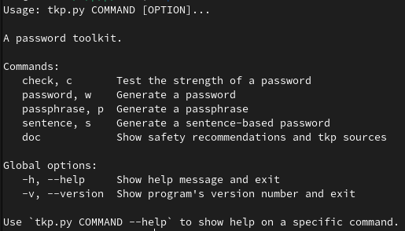

## TKPass

> **A Password ToolKit**

### Evaluate, generate, and much more.

## Features

 - __Test the strength of a password.__ Estimate the time to break it, give customized advice and check the exposition in word lists.
 - __Generate one or more passwords.__ Advanced customization of characteristics.
 - __Generate one or more passphrases.__ Longer and easier to remember passwords. Advanced customization of characteristics.
 - __Generate a password from a phrase.__ Remember the sentence to remember the password.
 - __Show password security recommendations__ and sources used.

## Installation

TKPass has been tested on Fedora, Ubuntu and Windows.
Python 3.6+ is required.

In the same directory as tkp, use the following command to install dependencies:

    python3 -m pip install -r requirements.txt

***On Windows, replace `python3` by `py`.***

## Usage

*In the TKPass repertory:*

### On Linux:

    python3 tkp.py
    
Or execute it once you have given it the permissions:

    sudo chmod +x tkp.py
    ./tkp.py

### On Windows:

    py tkp.py

---

To see the program usage:

    ./tkp.py --help
    
For example, to generate a password:

    ./tkp.py password

Or to check its strength:

    ./tkp.py check

### Open the configuration file `tkp.conf` to change important settings used by TKPass.
For example, the default password generation settings, the files used, the automatic copy and many other things.

## FAQ

#### How does the password review work ?

The zxcvbn module is used because it offers a realistic and advanced estimation of the security of a password.
Read more here: https://dropbox.tech/security/zxcvbn-realistic-password-strength-estimation

#### What is the Exposure report section in the password check ?

The exposure report shows the correspondences between the terms of the loaded dictionaries and the password.
All files in /dictionnaries/* are taken into account as word or password dictionaries exposed.
This directory can be changed in the configuration file.
You can also specify different files with the option --wordlist FILE [FILE ...]
These files must contain one element (word, password) per line.

#### Why is there a 'more data (unused)' folder ?

The 'more data (unused)' folder contains dictionary files available for use.
By default, it is not used by TKPass.
Download only the files you use because they are quite heavy.

#### It's not safe to enter my password in an unknown program.

Absolutely everything is done locally in the TKPass operations. The source code is easy enough to check review.
Alternatively, you can enter a password with the same attributes.

#### How to edit the password generation configuration used by default ?

The default password settings used is editable in the configuration file.

#### Is the random source for password generation secure ?

The python secret module is used to take advantage of the best random available on the operating system.

#### How to define the word lists used for passphrase generation ?

The --wordlist FILE option defines a specific file for the word source.
The default file used (without the --wordlist option) is defined in the configuration file.

## Contact, contributions and more

***Help and feedback are welcome.*** Feel free to contribute on GitHub!

Mail: dev_contactmail@protonmail.com
